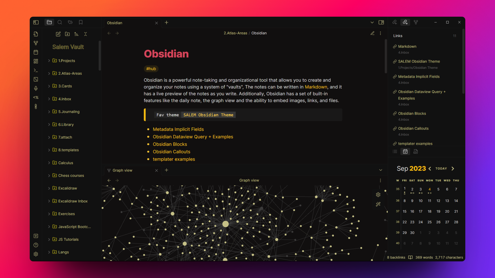
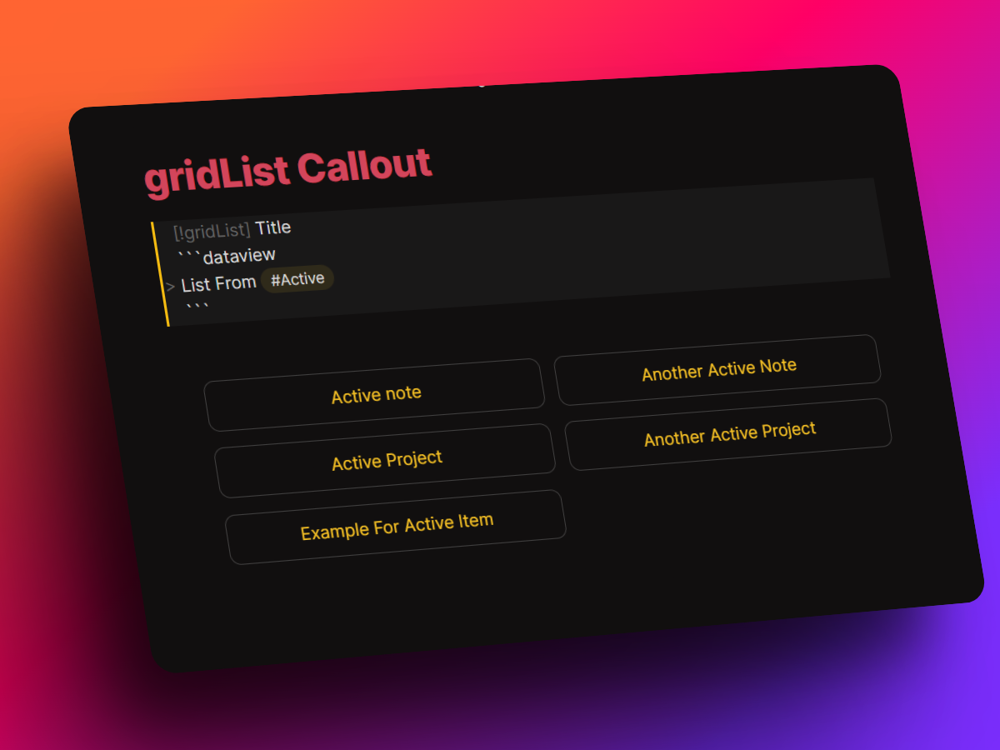
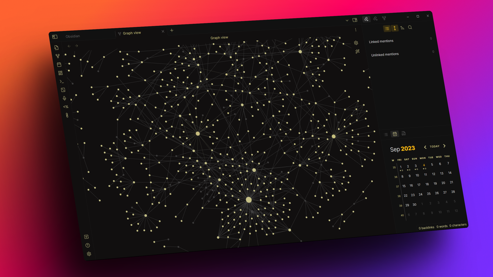

# SALEM-Obsidian-Theme

This is a custom theme to help you to get the most of for your note-taking and knowledge management needs in Obsidian. It has been crafted to provide you with a clean and comfortable user interface, with a focus on readability and ease of use, with some of special features.

If you find this project valuable or useful, you can [buy me a coffee](https://www.buymeacoffee.com/salemElatar).

## Features

- Center callout, which is the best and easiest solution to center text in Obsidian. no need to use ugly HTML tags or complex Latex,
  Just create new Callout and add the type as "CENTER" or "CENT", That's it.
  
- ListGrid Callout, it works with dataview "LIST", when you wrap the dataview query inside the callout, also works with simple markdown lists
  
- Better UI Spacing, the UI is more readable and easier to navigate. Dark mode Suitable for Low Light Environments
- Better RTL languages Support with improved readability and alignment in both reading and source view. (the main problem that has been fixed was in reading view, some element like the bullet points was aligned in the wrong side)
  
- Icons for folders to visually distinguish different folders and notes.
- Certain tags have different colors making it easier to visually identify and organize your notes
  
- Border-less Transparent cards in canvas, letting canvas to be more minimalistic
- compatible with most core and community plugins.
- header callouts that are inspired from the vicious-theme , use it as ">![callout-name_header]" . also there are a more custom callouts like "moon", "author", "comment"
- More features to come in future updates.

## Installation

To install any Obsidian theme:

- Open Obsidian and navigate to `Settings > Appearance`. In `themes` section select `manage`
- In the search box search for `Salem-theme` and install it, then click enable. that's it.

If you have ideas for improvements, please feel free to contact me: salem.elatar5@gmail.com, or open an issue or a pull request.
